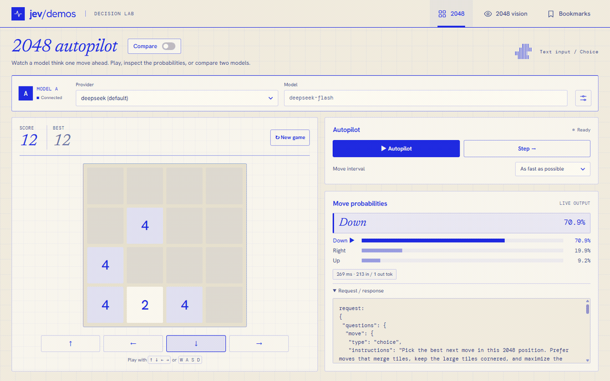

# LogJev

Bridge **ordinary LLMs** into the **Jev systemone API**: any OpenAI-compatible chat upstream that returns `top_logprobs` becomes a structured decision service (choice / score / noul primitives, full probability distributions). Supports **text, image, and audio input** through OpenAI-style multimodal messages; the selected model and endpoint must support both the input modality and the required logprobs. All upstream-specific compatibility switches live in `config.yaml`'s provider entries.

**Hosted and locally deployed LLMs are both supported.** The models listed below are the subset we have tested, not an allowlist. Any model served by an endpoint meeting these requirements can be connected.

[中文（完整文档）](README_zh.md) | English

This is the **Node.js / TypeScript implementation**. Use it for classification, routing, scoring, filtering, and other decisions with a finite answer space. It supports multiple upstream providers, per-request model selection, and official Jev passthrough. Provider keys stay on the server.



Live capture of the Node bridge using `deepseek-flash`: the model chooses legal moves while the board, score, and probability bars update. Recorded on 2026-09-22; this is a short gameplay example, not a game-performance benchmark. [Try the demo locally](http://127.0.0.1:8013/demos/2048/).

## How it works

```text
POST /v1/systemone {state|messages, questions}
  → shape each question into a separate chat prompt
    (choice → letter labels, score → level indices, noul → digits 1–9)
  → read the first content token: max_tokens=1, temperature=1,
    logprobs=true, top_logprobs=topk
  → discard sentinel logprobs, merge duplicate labels, apply constrained softmax
  → compute typed answers from the distribution; ignore sampled text
```

| Primitive | Question shape | Answer |
| --- | --- | --- |
| `choice` | Nonempty criteria object, up to **48 options** | Selected key, probabilities over all candidates, confidence |
| `score` | Ordered list of **2–10 levels** | Probability-weighted **zero-based** level mean, probabilities, confidence, legend |
| `noul` | A yes/no proposition in `instructions` | A weighted nine-level estimate mapped to **0.01–0.99** |

- A normal boundary read requests **one output token per question**. Retries can add calls and tokens. Every question repeats the context in its own prompt; batching questions does not make their input tokens free.
- `full` is the HTTP default: an instruction/data boundary, deliberation cues, and a repeated question. `minimal` uses a shorter prompt. Set `prompt_mode` per request to compare them.
- Missing logprobs trigger a reread; missing allowed labels trigger a firmer prompt. Persistent absence of logprobs returns 502; generated text is never parsed as a substitute.
- Probabilities are **not calibrated**. Bridge `confidence` is the largest candidate probability, and adding/removing candidates changes normalization. Use application data to choose thresholds.
- `score` may be fractional. `noul` has no separate confidence; put its decision boundaries in `instructions` because chat-mode `noul.criteria` is currently ignored.

Temperature 1 preserves the intended distribution for the reference configuration. The sampled token is unused; setting temperature 0 can collapse returned logprobs and undermine the probability readout.

## Repositories

| Repository | Responsibility |
| --- | --- |
| [logjev](https://github.com/DumoeDss/logjev) | Node.js server, portable Fetch handler, TypeScript API |
| [logjev-py](https://github.com/DumoeDss/logjev-py) | Python/FastAPI implementation and evaluation tools |
| [jev-demos](https://github.com/DumoeDss/jev-demos) | Shared browser demos, pinned as `demos/` in both backends |

Both implementations expose `choice`, `score`, and `noul`, support image and audio inputs through compatible multimodal upstreams, and pass official Jev providers through. The Python implementation is the behavioral reference for the bundled golden fixtures.

## Install from npm

Requires **Node.js 22+**. The npm package is **[@atelierai/logjev](https://www.npmjs.com/package/@atelierai/logjev)**; the CLI command is `logjev`. In a new application directory:

```sh
npm install @atelierai/logjev@0.1.1
cp node_modules/@atelierai/logjev/config.example.yaml config.yaml
cp node_modules/@atelierai/logjev/.env.example .env
# Set provider keys in .env and choose providers in config.yaml.
npx logjev
```

The package includes compiled code, demos, and skills. PowerShell users can replace `cp` with `Copy-Item`. The same `.tgz` package is available in the [v0.1.1 GitHub Release](https://github.com/DumoeDss/logjev/releases/tag/v0.1.1).

## Run from source

```sh
git clone --recurse-submodules https://github.com/DumoeDss/logjev.git
cd logjev
git submodule update --init --recursive
npm ci
cp config.example.yaml config.yaml
cp .env.example .env
# Set provider API keys in .env and choose providers in config.yaml.
npm run build
npm start
```

The copy steps are for first-time setup; edit existing configuration files if already present. PowerShell uses `Copy-Item config.example.yaml config.yaml` and `Copy-Item .env.example .env` for the copy steps.

Default API: **http://127.0.0.1:8013**. Shared demos: **http://127.0.0.1:8013/demos/**. The demos receive the running server's origin as their default endpoint, including custom ports. Saved per-model settings still take precedence. The separate Python service keeps port 8012 so both can run together.

`npm start -- --config /path/to/config.yaml` selects another configuration. A `.env` beside that configuration is loaded without overriding existing environment variables. `PORT`, `HOST` (default `127.0.0.1`), `LOGJEV_ACTIVE`, `PROMPT_MODE`, and `BRIDGE_API_KEY` override configuration. `OPENJEV_ACTIVE` remains a compatibility alias.

Node does not automatically read a sibling Python repository's `.env`. A provider declaring `api_key_env` requires that variable to be nonempty; missing credentials return 503 with setup instructions before any upstream call. Configure only the providers you use. Keyless local servers can omit `api_key_env`.

To share the existing Python configuration and keys, run from this repository (assuming the sibling folder is named `LogJev-py`):

```powershell
$env:PORT = '8013'
npm start -- --config ../LogJev-py/config.yaml
```

## Configuration

The YAML schema follows LogJev-py: `active`, `globals`, and named `providers`. Start with [config.example.yaml](config.example.yaml); the following excerpt shows two provider kinds:

```yaml
active: deepseek
globals:
  port: 8013
  prompt_mode: full
  read_temperature: 1.0
  topk: 20
  concurrency: 4
  timeout_ms: 60000
  retry_delays_ms: [800, 2000, 5000]
  cors_origins: ['*']
providers:
  deepseek:
    kind: chat
    base_url: https://api.deepseek.com/v1
    api_key_env: DEEPSEEK_API_KEY
    model: deepseek-flash
    extra_body:
      thinking: {type: disabled}
  jev:
    kind: jev
    base_url: https://api.typesafe.ai/v1/systemone
    api_key_env: TYPESAFE_API_KEY
    model: jev-1.13
```

`kind: chat` appends `/chat/completions` to `base_url`; `kind: jev` uses the **complete endpoint URL** and forwards the official decision payload. `api_key_env` names an environment variable, not a literal key. Provider `topk` overrides the global value; `extra_body` supplies upstream-specific options such as disabling thinking.

| Setting | Default / behavior |
| --- | --- |
| `active` | Default provider; request `provider` can select another configured entry |
| `globals.prompt_mode` | `full`; request `prompt_mode` overrides it for chat providers |
| `globals.read_temperature` / `topk` | `1.0` / `20` |
| `globals.concurrency` | `4` concurrent chat questions, shared across requests |
| `globals.timeout_ms` | `60000` per upstream attempt; Node option |
| `globals.retry_delays_ms` | `[800, 2000, 5000]`; transient network errors and 429/500/502/503/504/529 |
| `globals.cors_origins` | `['*']`; may be an explicit list of browser origins |
| `floor_gap` | Legacy entry; both implementations currently use a fixed gap of **5** |

Environment overrides: `PORT`, `HOST`, `LOGJEV_ACTIVE`, `PROMPT_MODE`, `BRIDGE_API_KEY`. Provider selection precedence is request `provider` → `LOGJEV_ACTIVE` → legacy `OPENJEV_ACTIVE` → YAML `active`. Restart the process after changing configuration or `.env`.

## HTTP API

| Endpoint | Behavior |
| --- | --- |
| `POST /v1/systemone` | `{provider?, model?, state\|messages, questions, prompt_mode?}` → `{model, answers, usage, latency_ms}` |
| `GET /v1/providers` | `{active, providers: [{name, kind, model}]}`; no keys |
| `GET /v1/models` | Active chat provider's model IDs, default first; an official provider returns its configured model |
| `GET /health` | Configuration metadata and service health; no inference call |

`BRIDGE_API_KEY`, when set, requires `Authorization: Bearer <key>` on decision requests. Provider keys are only sent from the server to their configured upstream. The Node HTTP adapter accepts JSON request bodies up to 16 MiB.

Use either `state` (string or JSON) or `messages` (conversation), not both. Message roles are `system`, `user`, or `assistant`; content is text or a nonempty array of `text` / `image_url` / `input_audio` / `audio_url` parts. Use the user role for media where required by the upstream. `questions` must be a nonempty object; each question needs a nonempty string `instructions`.

Omit `model`, or use `jev-latest`, to select the chosen provider's configured model. Any other model string is forwarded as its upstream model ID. Official passthrough preserves answers and extra response fields, adds bridge latency, and leaves question semantics to the official API; bridge `prompt_mode` does not apply there.

## Try it

### Text decision

```sh
curl http://127.0.0.1:8013/v1/systemone -H 'Content-Type: application/json' -d '{"state":"The customer was charged twice.","questions":{"refund":{"type":"noul","instructions":"Does the customer need a refund?"}}}'
```

### Multiple questions with Node.js

This uses built-in `fetch`, with no client SDK dependency. Save it as an `.mjs` file or run it in an ESM project:

```js
const endpoint = process.env.LOGJEV_URL || 'http://127.0.0.1:8013';
const headers = { 'Content-Type': 'application/json' };
if (process.env.BRIDGE_API_KEY) headers.Authorization = `Bearer ${process.env.BRIDGE_API_KEY}`;
const response = await fetch(`${endpoint}/v1/systemone`, {
  method: 'POST', headers, signal: AbortSignal.timeout(30_000),
  body: JSON.stringify({
    state: { ticket: 'I was charged twice. Please fix it before tomorrow.' },
    questions: {
      intent: {
        type: 'choice', instructions: 'What is the main customer request?',
        criteria: { refund: 'Refund or billing correction', tech_help: 'Technical help', other: 'Neither' },
      },
      urgency: {
        type: 'score', instructions: 'How much time pressure is explicitly stated?',
        criteria: ['No deadline', 'A future deadline', 'Immediate service disruption'],
      },
      has_deadline: { type: 'noul', instructions: 'Does the ticket explicitly state a deadline?' },
    },
  }),
});
if (!response.ok) throw new Error(`LogJev HTTP ${response.status}: ${await response.text()}`);
const result = await response.json();
console.log(result.answers, result.usage, result.latency_ms);
```

`LOGJEV_URL` here is a **client convention**, not a server configuration variable. Chat responses aggregate `usage.input_tokens` and `output_tokens` reported by successful upstream reads. `usage.reads` currently counts questions, **not retry attempts**; it is not an API-call counter. Validate returned candidates/distributions before acting on them.

### Image input

Send this JSON to the same endpoint using a vision-capable chat provider. Replace the image URL with a real accessible image or a `data:image/png;base64,...` URL:

```json
{
  "messages": [{"role": "user", "content": [
    {"type": "text", "text": "Inspect this screenshot."},
    {"type": "image_url", "image_url": {"url": "https://example.com/screenshot.png"}}
  ]}],
  "questions": {
    "has_error": {"type": "noul", "instructions": "Is an error message visible in the screenshot?"}
  }
}
```

Image parts remain in the conversation; the bridge appends the decision question as text. The vision demo sends its actual canvas PNG and shows exactly what was sent.

### Audio input

Audio goes directly into the conversation; the bridge does not transcribe or transcode it. Use the format required by your provider:

- `input_audio`: `{ "type": "input_audio", "input_audio": { "data": "BASE64_AUDIO", "format": "wav" } }`. Supply raw base64, without a data-URL prefix. [OpenRouter requires this format](https://openrouter.ai/docs/guides/overview/multimodal/audio); direct audio URLs are not supported there.
- `audio_url`: `{ "type": "audio_url", "audio_url": { "url": "data:audio/wav;base64,BASE64_AUDIO" } }`. This is the format verified with [NVIDIA Nemotron Omni](https://docs.api.nvidia.com/nim/reference/nvidia-nemotron-3-nano-omni-30b-a3b-reasoning). URL schemes and codecs depend on the upstream; the bridge forwards the part unchanged.

Merge this provider into your `config.yaml` and set `NIM_API_KEY` in `.env` (it is also included in the sample configuration):

```yaml
providers:
  nim-omni:
    base_url: https://integrate.api.nvidia.com/v1
    api_key_env: NIM_API_KEY
    model: nvidia/nemotron-3-nano-omni-30b-a3b-reasoning
    topk: 5
    extra_body:
      chat_template_kwargs: {enable_thinking: false}
```

With a real `request.wav` file:

```js
import { readFile } from 'node:fs/promises';

const audio = (await readFile('request.wav')).toString('base64');
const response = await fetch('http://127.0.0.1:8013/v1/systemone', {
  method: 'POST',
  headers: { 'Content-Type': 'application/json' },
  body: JSON.stringify({
    provider: 'nim-omni',
    messages: [{ role: 'user', content: [
      { type: 'audio_url', audio_url: { url: `data:audio/wav;base64,${audio}` } },
    ] }],
    questions: { intent: {
      type: 'choice', instructions: 'What is the main request in the recording?',
      criteria: { refund: 'Refund or billing correction', technical: 'Technical support', other: 'Neither' },
    } },
  }),
});
if (!response.ok) throw new Error(await response.text());
console.log((await response.json()).answers.intent);
```

Audio fields must be nonempty strings. The bridge validates their structure; decoding, codec support, and duration limits are the upstream's responsibility. Both audio formats preserve the original content through per-question prompts and retries. If bridge authentication is enabled, also send its Bearer key.

**Live probes on 2026-09-22** used synthetic speech without a transcript in the decision request:

| Endpoint / model | Audio and LogJev result |
| --- | --- |
| NIM `nvidia/nemotron-3-nano-omni-30b-a3b-reasoning` | **Works with `audio_url` and thinking disabled.** Both Node and Python classified two recordings as refund / technical support and returned probability distributions. Python also returned `score` and `noul` responses. |
| OpenRouter `xiaomi/mimo-v2.6-pro` | Audio transcription and classification worked, but text and audio reads returned `logprobs: null`. Strict parameter routing returned 404. **Currently incompatible with LogJev probability decisions.** |
| OpenRouter `meta/muse-spark-1.3-contributor` | After account age confirmation, disabling reasoning returned 400; the provider explicitly rejected logprobs with reasoning enabled. It also required at least 16 output tokens. **Currently incompatible.** |

For NIM, use the tested `audio_url` form: an `input_audio` control did not reproduce the recording's transcript. The hosted endpoint sometimes returned 2–3 completion tokens despite `max_tokens: 1`; account for actual usage. Two correctly classified recordings demonstrate connectivity, not general accuracy or calibration. No audio-compatible probability result was established for the two OpenRouter routes; generated text is never substituted for missing logprobs.

The Node HTTP request body limit is **16 MiB**; base64 adds roughly one third to the file size. Keep recordings within this limit.

### Errors

| Status | Meaning |
| --- | --- |
| 401 | Missing or invalid bridge Bearer key |
| 422 | Invalid JSON, provider, model, context, prompt mode, or question |
| 413 | Node HTTP body limit exceeded |
| 502 | Upstream failure, exhausted retries, invalid upstream response, or missing logprobs |
| 503 | Selected provider's configured API-key variable is empty; configure its environment or adjacent `.env` and restart |

Upstream errors, including a final upstream 429 or 401, are reported by this bridge as 502 with a diagnostic; they are not transparently forwarded as HTTP status codes. A healthy `/health` confirms loaded configuration, not working upstream credentials or logprob support.

## Demos

Start the bridge and open **[the demo workspace](http://127.0.0.1:8013/demos/)**. `demos/` is the shared `jev-demos` Git submodule: plain HTML/CSS/JavaScript, bundled fonts, no frontend build step. The Node server supplies its origin as the default API endpoint.

| Demo | Input and behavior | Open locally |
| --- | --- | --- |
| [2048 autopilot](demos/2048/) | Text board state; each move is one `choice` question over legal directions, with live probabilities and request/response details | [2048](http://127.0.0.1:8013/demos/2048/) |
| [2048 vision](demos/2048-vision/) | PNG board screenshot without a text board; inspect the exact model input alongside the decision; requires a vision upstream | [Vision](http://127.0.0.1:8013/demos/2048-vision/) |
| [Bookmarks triage](demos/bookmarks/) | Import browser bookmarks HTML, paste links, or load an example; edit categories, classify in batches, and review low-confidence results | [Bookmarks](http://127.0.0.1:8013/demos/bookmarks/) |

The two 2048 demos support manual moves, one-step decisions, autoplay, and reset. **Move interval defaults to “As fast as possible”** (no extra delay between completed requests). Game rules filter out illegal moves before asking the model; it chooses among executable directions. Request / response, and Image input when present, start expanded.

The bookmark demo flags confidence below **0.6** for review and displays token totals. Stop finishes in-flight work and preserves partial results; its threshold is a demo policy, not a calibrated accuracy guarantee.

**Compare sits beside the page title.** Turning it on creates two complete, independently configured instances. Each has provider, model, endpoint, and prompt mode controls; A keeps its current board/results, and closing B stops its autoplay. This allows Node/Python, model, or provider comparisons without losing the current run. Vision filters out the demo's official text-only providers.

The workspace uses Cobalt Grid: paper/cobalt colors, local typography, and a full-width desktop layout. Desktop comparison keeps the main game workspace within the viewport; long JSON scrolls within its panel. Small screens use normal page scrolling. Provider credentials stay on the bridge; requests still send the selected input to the configured upstream.

To serve the frontend separately from either backend:

```powershell
# From the shared jev-demos repository, or this repository's demos directory:
$env:JEV_ENDPOINT = 'http://127.0.0.1:8013'
node serve.mjs
```

The standalone server defaults to port 8099 and, without `JEV_ENDPOINT`, Python port 8012. Saved browser/per-instance endpoints take precedence over server defaults. Existing `openjev.*` storage keys remain compatible. The demo UI has no bridge Bearer-key field; use an appropriate authenticated client when enabling `BRIDGE_API_KEY`.

## Locally deployed models

LogJev has no provider or model allowlist. Point `base_url` at your local or private-network OpenAI-compatible service and set `model` to the ID it serves. For example, a minimal `config.yaml` is:

```yaml
active: local
providers:
  local:
    kind: chat
    base_url: http://127.0.0.1:8000/v1
    model: your-served-model-id
    topk: 20
```

No API key is needed if that server does not require one; otherwise set `api_key_env` and put the key in `.env`. Set `topk` within the server's supported range, and use `extra_body` for any model-specific thinking switch.

Compatibility depends on **both the model and the inference server**: `/chat/completions` must return the first content token's `top_logprobs`, with the decision labels present in that distribution. An OpenAI-compatible URL alone is insufficient. Images and audio additionally require the corresponding input support. The compatibility table below records only tested examples; unlisted local models are not excluded.

## Upstream compatibility

The requirements are an OpenAI-compatible chat endpoint, **first-content-token `top_logprobs`**, and a label that can appear as that first token. Disable thinking through the provider's own options where needed.

The following is the **2026-09 probe record from LogJev-py**, retained as configuration guidance. It is not a new Node live-provider test or a guarantee about today's model catalog:

| Upstream / model | Recorded result | Provider options |
| --- | --- | --- |
| DeepSeek `deepseek-flash` (direct) | Compatible, including images | `extra_body: {thinking: {type: disabled}}` |
| OpenRouter `qwen/qwen3.8-27b` | Compatible, including images | `extra_body: {reasoning: {enabled: false}}`, `topk: 5` |
| OpenRouter `qwen/qwen3.8-flash` | Compatible, including images | Same reasoning switch, `topk: 5` |
| OpenRouter `deepseek/deepseek-v4.1-flash` | Compatible | OpenRouter reasoning switch, `topk: 20` |
| NVIDIA NIM `google/diffusiongemma-26b-a4b-it` | Compatible | No thinking switch needed in the recorded probe |
| OpenRouter `z-ai/glm-5.3-flash` | Incompatible | Mandatory reasoning and no content logprobs in the recorded probe |

The reference Qwen routes capped `top_logprobs` at 5. OpenRouter may route the same model to different backends; a reread helps with occasional missing logprobs but cannot fix an incompatible model. Its recorded DeepSeek route used `reasoning`, not the direct provider's `thinking` option.

To probe a new upstream, use the sibling Python tool. It reads the **Python repository's** provider configuration; the explicit-endpoint form avoids confusing it with the Node configuration:

```sh
cd ../LogJev-py
uv run python probe_upstream.py --provider openrouter --models qwen/qwen3.8-27b
uv run python probe_upstream.py --base-url https://api.deepseek.com/v1 --api-key-env DEEPSEEK_API_KEY --models deepseek-flash
```

## Reference benchmark and costs

These are **historical Python implementation measurements**, copied from `LogJev-py/README_zh.md` (2026-09, authored144). Chat rows used the `full` recipe; the official row used its native Decisions API. Node golden tests verify covered prompt/math behavior, not live accuracy, latency, or billing.

| Model | Accuracy | Family balanced | P50 | Input $/M tokens | Output $/M tokens | Input tokens/question | Cost / 144 questions |
| --- | --- | --- | --- | --- | --- | --- | --- |
| DeepSeek `deepseek-flash` (direct) | **96.5%** | 96.8% | ~0.5s | $0.15 off-peak / $0.30 peak | $0.60 / $1.20 | 175 | ~$0.0040 / $0.0081 |
| Official `typesafe/jev-1.13` (OR Decisions) | **97.2%** | 97.1% | **0.49s** | $0.042 | $0 | 371 | **$0.0022 paid** |
| OpenRouter `qwen/qwen3.8-flash` | 87.5% | 87.4% | 1.07s | $0.15 | $0.47 | 203 | ~$0.0045 |
| NIM `diffusiongemma-26b-a4b-it` | 86.1% / 84.0% | 85.8% | ~1.5s | Recorded free tier | Recorded free tier | 189 | $0 |
| OpenRouter `qwen/qwen3.8-27b` | 77.8% | 79.6% | 0.84s | $0.20 | $2.50 | 236 | ~$0.0072 |

DeepSeek's row was rerun at temperature 1.0. The Qwen/NIM rows are older temperature-0 results and were **not rerun under the current default**; they are not directly comparable current rankings. The two NIM accuracies show run-to-run variation. Earlier equal-score/error-overlap claims for DeepSeek and official Jev belonged to the old T=0 run.

Prices are the recorded snapshot, not current quotes. Bridge totals use measured tokens × recorded rates, with all DeepSeek input treated as cache misses; official cost was reported by `usage.cost`. The recorded DeepSeek cache-hit input rate was $0.003/$0.006 per million tokens. Multiple questions repeat state in chat mode; the official API's batching economics are different. Probe and evaluation commands make real upstream calls.

## Evaluation

Datasets and live evaluation tools remain in **LogJev-py**, so the two implementations can use one benchmark harness. The datasets originate from SemIf; provenance and manifests are in that repository's `eval/data/README.md`.

| Dataset | Rows | Ground truth | Measures |
| --- | --- | --- | --- |
| `authored144.jsonl` | 144 | Yes | Choice accuracy across evidence, rule, and candidate families |
| `perturbations108.jsonl` | 108 | Yes | Stability under reordered options, criterion wrappers, and irrelevant context |
| `shape777.jsonl` | 777 | No | Cross-system agreement and confidence, not accuracy |

With the Node bridge running on 8013, run from the Python repository:

```sh
cd ../LogJev-py
uv run python eval_compare.py --bridge http://127.0.0.1:8013 --data eval/data/authored144.jsonl --modes logjev/full,logjev/minimal --out eval_node_authored144.json
uv run python eval_compare.py --bridge http://127.0.0.1:8013 --data eval/data/perturbations108.jsonl --modes logjev/full,logjev/minimal --out eval_node_perturbations108.json
uv run python eval_compare.py --bridge http://127.0.0.1:8013 --data eval/data/shape777.jsonl --modes logjev/full,logjev/minimal --out eval_node_shape777.json
```

Use `--limit` for a small trial, `--model` to override the active provider's model, and `--pace` to respect upstream limits. Select the intended active provider when starting the bridge. The explicit `--modes` above limits evaluation to that bridge; adding `jev-1.13` calls the harness's separate official reference endpoint. Evaluate Node latency and cost directly before making performance claims.

## Use the Fetch handler

Import `createBridge` from `@atelierai/logjev`. The core has no Node-specific imports; filesystem configuration and the HTTP adapter live in `@atelierai/logjev/node`.

```ts
import { createBridge } from '@atelierai/logjev';

const handle = createBridge({
  active: 'local',
  providers: {
    local: { name: 'local', kind: 'chat', baseUrl: 'http://localhost:8000/v1', model: 'your-model' },
  },
});
const response = await handle(new Request('http://localhost/health'));
```

The Fetch handler has been tested in Node. Other Fetch-compatible runtimes need their own deployment adapter and validation.

## Validation

```sh
npm test
# Regenerate only when deliberately updating reference behavior:
python test/generate-golden.py ../LogJev-py
```

Tests cover 96 Python-derived prompt cases, 384 distributions, sentinel/duplicate-token parsing, choice limits, multimodal context, missing-logprob and firm retries, official passthrough, 429/529 backoff, usage accounting, concurrency across requests, authentication, CORS, and the actual HTTP/static adapter. They use mocked upstreams and incur no API fees. Golden fixtures cover the documented examples; arbitrary JSON number formatting and numeric object-key ordering may differ between JavaScript and Python, so use named criteria and string state when exact prompt bytes matter.

## Agent skills

[skills/jev/SKILL.md](skills/jev/SKILL.md) is an installable skill for agents using Jev-style decisions. It includes Node `fetch` examples and references for [the API](skills/jev/references/api-reference.md), [integration patterns](skills/jev/references/patterns.md), and [pitfalls](skills/jev/references/pitfalls.md): question design, response validation, confidence gates, failure handling, batching, and provider-specific calibration.

Copy it into the chosen agent's skill directory (choose one destination; inspect an existing `jev` skill before replacing it):

```sh
# Claude Code: project-level or personal
mkdir -p .claude/skills
cp -R skills/jev .claude/skills/jev
# Or, for Codex personal skills:
mkdir -p ~/.codex/skills
cp -R skills/jev ~/.codex/skills/jev
```

PowerShell equivalent for Codex:

```powershell
$skillRoot = Join-Path $env:USERPROFILE '.codex/skills'
New-Item -ItemType Directory -Path $skillRoot -Force | Out-Null
Copy-Item -LiteralPath ./skills/jev -Destination (Join-Path $skillRoot 'jev') -Recurse
```

Then ask, for example: “Use Jev to classify ticket intent and urgency, sending uncertain cases for review.” The skill defaults to the Node bridge on 8013; Python on 8012 can be explicitly selected. Installing both repository variants under the same skill name is unnecessary. Skills ship in the npm package as well as this repository.

## Structure and limitations

```text
src/jev.ts           prompt shaping, normalization, logprob parsing, distribution math
src/bridge.ts        portable Fetch handler, providers, retries, concurrency, usage
src/config.ts        YAML and environment configuration
src/server.ts        Node HTTP adapter and endpoint-aware demo hosting
src/cli.ts           startup, config selection, .env loading
config.example.yaml provider topology and global options
test/                Python-derived golden fixtures and mocked integration tests
demos/               shared jev-demos Git submodule
skills/jev/          agent skill and API / patterns / pitfalls references
```

Known approximations: missing labels receive `min(top_logprobs) - 5`; `noul` is a nine-level linear mapping; no noise averaging is implemented. A fallback distribution with floored labels is not evidence of calibration. The Node adapter handles local HTTP deployment; other Fetch runtimes need deployment-specific validation.

## Shared demo updates

Both backends pin `demos/` to a commit in `../jev-demos`. Commit UI changes there first, then update and commit each backend's gitlink. For initial remote clones, use `git clone --recurse-submodules`. Place all three repositories under the same GitHub owner to keep the relative submodule URL valid.

`npm pack --dry-run` checks the distributable: compiled files, demos, skills, configuration examples, and both READMEs. Runtime logs, local `config.yaml`, `.env`, and development tests are excluded. Release artifacts and checksums are available on [GitHub Releases](https://github.com/DumoeDss/logjev/releases); see [CHANGELOG.md](CHANGELOG.md) for version history. GitHub's automatic source archives omit submodule contents; use a recursive clone or the npm package for bundled demos.
